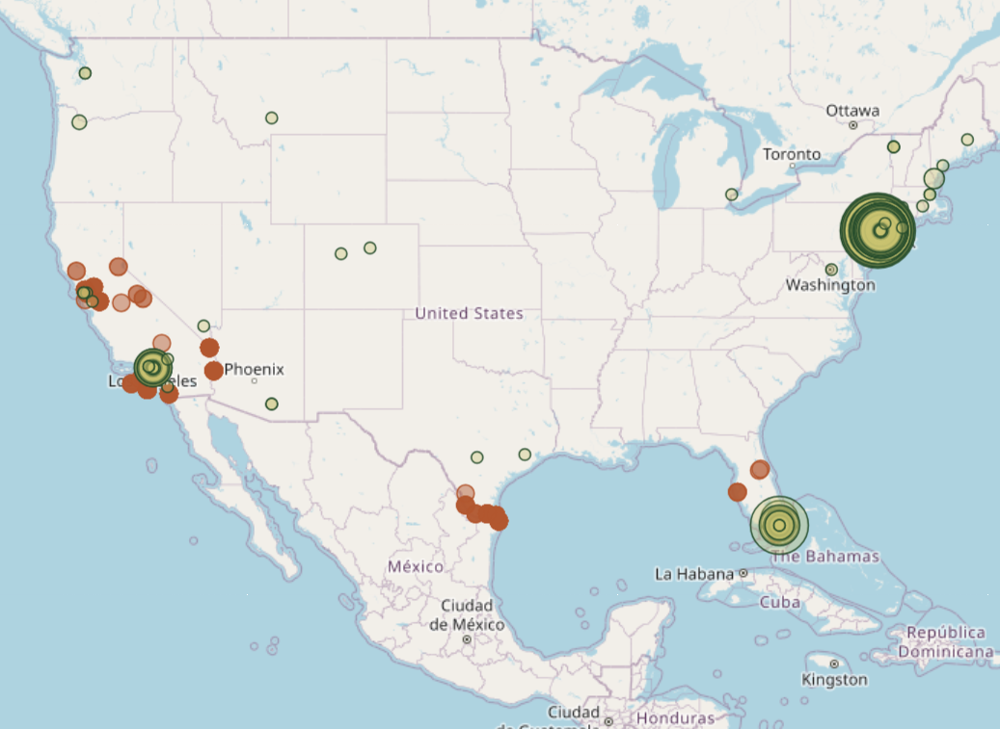

# Fly Spy

> Find where invasive fruit flies outbreak and where they originate.

Using Geospatial datam fruit fly outbreaks are found and traced to seaports or airports of entry. This is then further tracked to possible origins and used to help make policy and prevention stategies against these invasive flies.

## Screenshots
   

## Features

- Imports `fruit_fly_detections.csv` detections by month, county, state, and approximate map centroid.
- Imports `international_segmentation.csv` and keeps **inbound international traffic to the United States** where `DEST_COUNTRY` / `DEST_COUNTRY_NAME` is US / United States.
- Computes monthly lagged Pearson correlations between fruit fly detections and inbound traffic by origin country.
- Ranks origin countries with a risk-style score based on positive correlation, traffic volume, and detection volume.
- Displays seasonal hotspot maps using Leaflet.
- Shows annual port freight context from `2020Ports.csv`, `2021Ports.csv`, and `2022Ports.csv`.

## Datasets
https://drive.google.com/drive/folders/1SxLnjxejRmRQClYa27pDyfTx6Si5yzYy?usp=drive_link

## Setup

```bash
cd website
```

From inside the `website` directory:

```bash
python -m venv .venv
.venv\Scripts\activate
pip install -r requirements.txt
```

Make a `data/` directory:

```bash
mkdir data
```

Copy these files into it with exactly these names:

```text
fruit_fly_detections.csv
international_segmentation.csv
2020Ports.csv
2021Ports.csv
2022Ports.csv
```

Create the database tables:

```bash
python manage.py makemigrations outbreaks
python manage.py migrate
```

Import the data:

```bash
python manage.py import_data --data-dir data --clear
```

Run the site:

```bash
python manage.py runserver
```

Open:

```text
http://127.0.0.1:8000/
```
