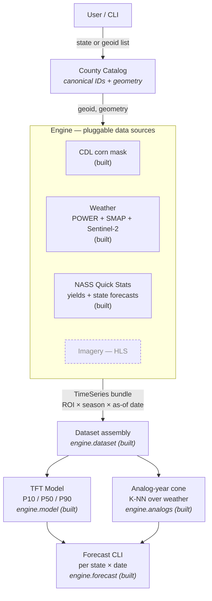
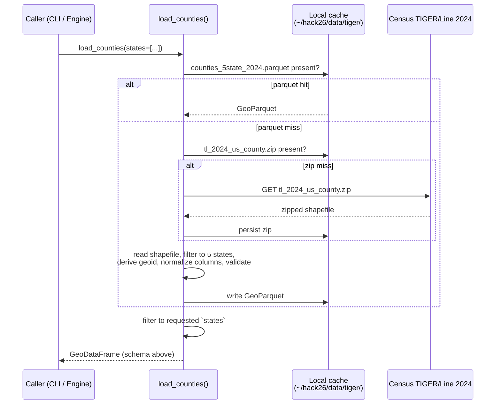
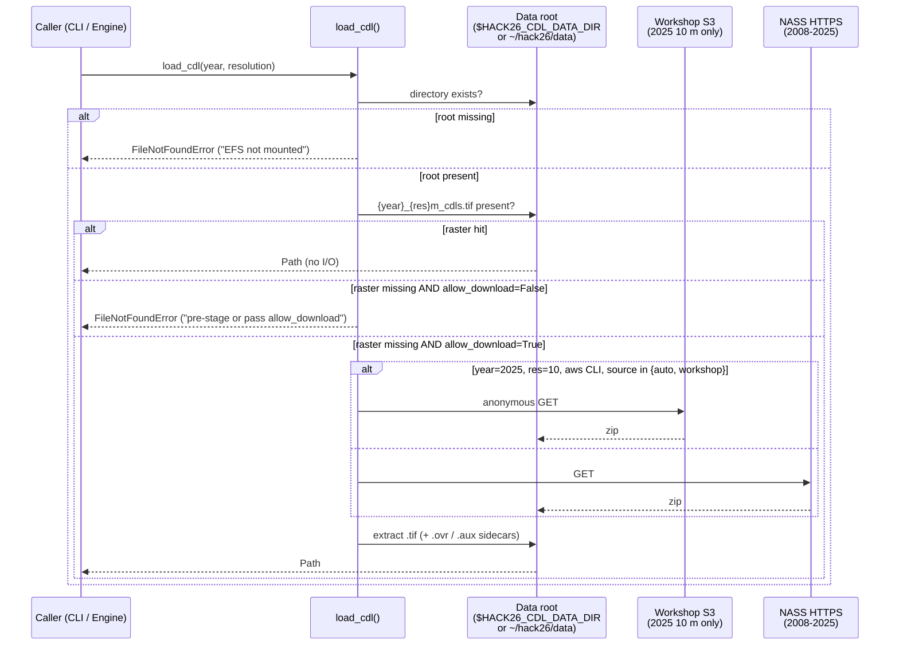
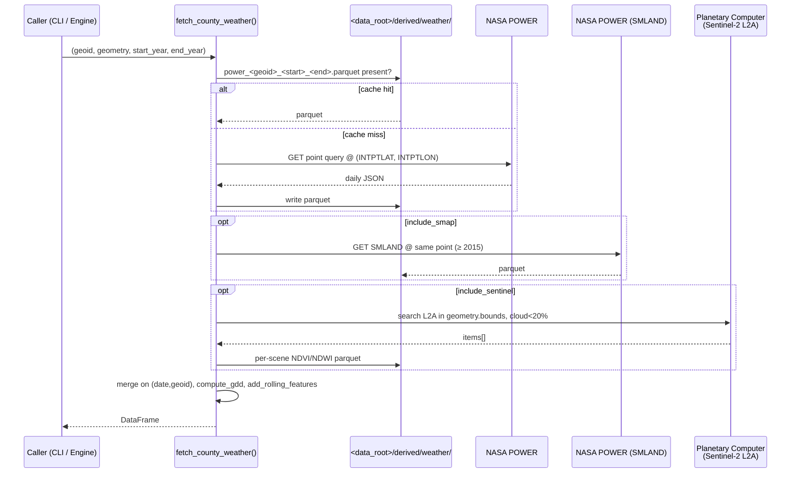
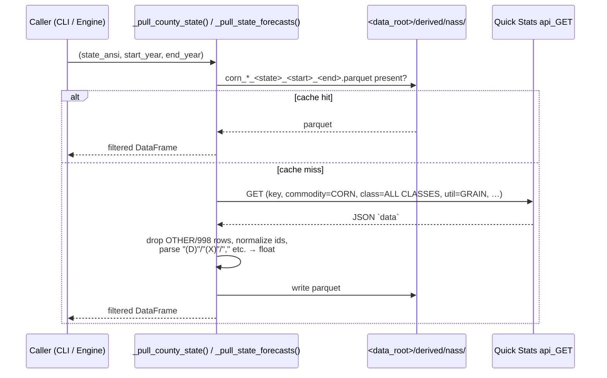
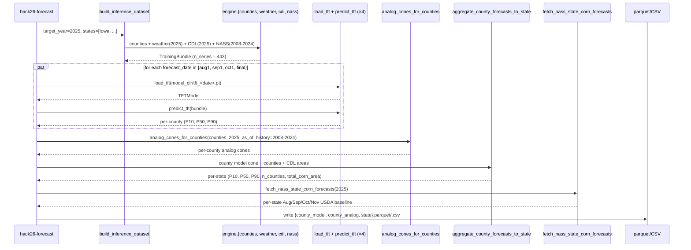
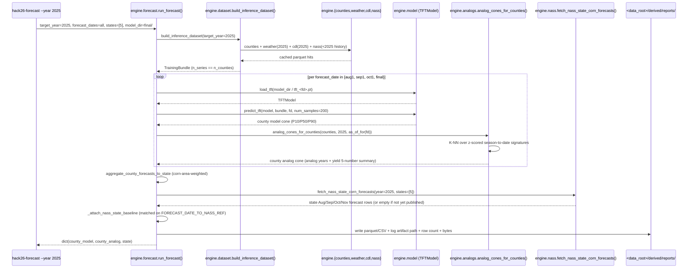

# Geospatial AI Crop Yield Forecasting — System Spec

> **Status.** This document describes the system **as built**. Components marked
> *planned* in the architecture diagram are not yet implemented; everything else
> is wired up, tested, and exercised by the CLIs in §11.

---

## Contents

**Part I — Foundations**
1. [Problem](#1-problem)
2. [Architecture — "ROI in, forecast out"](#2-architecture--roi-in-forecast-out)
3. [Region of Interest (ROI)](#3-region-of-interest-roi)

**Part II — Engine Components**
4. [County Catalog `engine.counties`](#4-component-county-catalog-enginecounties)
5. [CDL Corn Mask `engine.cdl`](#5-component-cdl-corn-mask-enginecdl)
6. [Weather `engine.weather`](#6-component-weather-engineweather)
7. [NASS / Quick Stats `engine.nass`](#7-component-nass--quick-stats-enginenass)

**Part III — Repository & Operations**
8. [Repository layout](#8-repository-layout)
9. [On-disk cache layout](#9-on-disk-cache-layout)
10. [Environment variables](#10-environment-variables)
11. [Operations](#11-operations)

**Part IV — Model & Forecast**
12. [Model + Forecast `engine.{dataset, model, analogs, forecast}`](#12-component-model--forecast-enginedataset-enginemodel-engineanalogs-engineforecast)

---

# Part I — Foundations

## 1. Problem

Forecast **corn-for-grain yield (bu/acre)** for **Iowa, Colorado, Wisconsin,
Missouri, Nebraska** at four points in the growing season (Aug 1, Sep 1,
Oct 1, final), each wrapped in an analog-year **cone of uncertainty**.

Replacement target: the USDA enumerator survey (~1,600 boots-on-the-ground,
~$1–1.5 M per pass, 4×/year, with dwindling participation).

## 2. Architecture — "ROI in, forecast out"

Solid boxes are implemented; dashed boxes are planned components that plug
into the same Engine contract.



**Design rules every Engine source follows.**

- **Join key is `geoid`** (5-digit county FIPS).
- **Each source is a function** of the form
  `fetch(geoid, geometry, date_range) -> pd.DataFrame`. Sources are
  independent, cacheable, and individually testable.
- **The County Catalog owns geometry.** Downstream sources receive the
  polygon; they never re-derive it.
- **Caches are content-addressed.** Cache filenames embed the inputs that
  determine the output — `geoid`, year range, sorted-geoid hash — so
  identical calls hit the same file and different inputs cannot collide.

## 3. Region of Interest (ROI)

MVP scope is **county-level** ROIs in the 5 target states:

| State     | FIPS | # counties |
| --------- | ---- | ---------- |
| Colorado  | 08   |  64        |
| Iowa      | 19   |  99        |
| Missouri  | 29   | 115        |
| Nebraska  | 31   |  93        |
| Wisconsin | 55   |  72        |
| **Total** |      | **443**    |

County granularity matches USDA NASS's published corn yields, giving the
richest training signal at a tractable scale.

The Engine contract takes a **generic polygon**, so any sub-county ROI (a
producer's field, a watershed, an AgNext research plot) plugs in without
code changes.

---

# Part II — Engine Components

Every component below follows the same template:
*Purpose → Source → Output schema → Public API → Cache layout → Call flow →
Non-goals.*

## 4. Component: County Catalog `engine.counties`

**Purpose.** Return one canonical `GeoDataFrame` of every county in the 5
target states, keyed by `geoid`, carrying the geometry every other Engine
source needs.

**Source.** Census Bureau TIGER/Line **2024** national county shapefile —
single authoritative file, free, no auth. Pinned vintage (`TIGER_YEAR =
2024`). Cached locally on first call.

**Output schema.**

| Column          | Type            | Notes                                        |
| --------------- | --------------- | -------------------------------------------- |
| `geoid`         | str (5)         | Primary key. State FIPS + county FIPS.       |
| `state_fips`    | str (2)         |                                              |
| `county_fips`   | str (3)         |                                              |
| `name`          | str             | "Story", "Larimer", …                        |
| `name_full`     | str             | "Story County", "Larimer County", …          |
| `state_name`    | str             | Human-readable state.                        |
| `centroid_lat`  | float           | TIGER `INTPTLAT` (interior point, not bbox). |
| `centroid_lon`  | float           | TIGER `INTPTLON`.                            |
| `land_area_m2`  | Int64           | TIGER `ALAND`. For per-area normalization.   |
| `water_area_m2` | Int64           | TIGER `AWATER`.                              |
| `geometry`      | shapely Polygon | EPSG:4269 (NAD83), as published by Census.   |

Invariants asserted before the frame is returned:

- `geoid` is unique;
- `geoid` is exactly 5 chars;
- every row has a non-null geometry.

**Public API.**

```python
from engine.counties import load_counties

gdf = load_counties()                       # all 5 states
gdf = load_counties(states=["Iowa"])        # subset by name or FIPS
gdf = load_counties(refresh=True)           # re-download + rebuild cache
```

`states=` accepts state names (`"Iowa"`) or 2-digit FIPS (`"19"`); unknown
values raise `ValueError`. `states=[]` (an *empty* list, vs. the default
`None`) is treated as a user error and also raises — silent zero-row
output is a footgun we surface loudly.

**Cache layout.** Two layers under `~/hack26/data/tiger/`:

```
~/hack26/data/tiger/
├── tl_2024_us_county.zip                  # raw national shapefile (~120 MB)
└── counties_5state_2024.parquet           # normalized 5-state lookup
```

The raw zip is kept so a `refresh` rebuild does not have to re-download.
`refresh=True` rebuilds **both** layers. Override the parent with
`HACK26_CACHE_DIR` (the `tiger/` subdir is appended automatically).

**Call flow.**



**Non-goals.**

- No reprojection — downstream sources reproject to whatever they need
  (CDL → Albers, Sentinel → UTM, NASS → FIPS-keyed only).
- No sub-county geometries.
- No alternate vintages — TIGER 2024 is pinned via `TIGER_YEAR` in
  `engine/counties.py`.

## 5. Component: CDL Corn Mask `engine.cdl`

**Purpose.** Project the USDA Cropland Data Layer national raster down to
per-county corn statistics keyed on `geoid`, so it slots into the §2 Engine
contract and joins against the County Catalog without any glue.

**Source.** USDA NASS Cropland Data Layer — annual, geo-referenced,
crop-specific raster covering CONUS.

| Resolution | Years     | Note                                                          |
| ---------- | --------- | ------------------------------------------------------------- |
| 30 m       | 2008–2025 | Resampled from the 10 m product for 2024+; native for ≤2023.  |
| 10 m       | 2024–2025 | Native generation; ~9.8 GB zipped, ~14.9 GB extracted (2025). |

Downloads go through one of two endpoints (only consulted under
`--allow-download`):

- **NASS HTTPS** —
  `https://www.nass.usda.gov/Research_and_Science/Cropland/Release/datasets/{year}_{res}m_cdls.zip`.
  Default. Covers every (year, resolution) combination above.
- **Workshop S3 mirror** — `s3://rayette.guru/workshop/2025_10m_cdls.zip`,
  anonymous read via `aws s3 cp --no-sign-request`. Only hosts 2025 10 m;
  used automatically when running on the AWS sagemaker workshop box for
  that one combo (faster in-region transfer); otherwise NASS is used.

**Output schema** (one row per county, returned by `fetch_counties_cdl`):

| Column                  | Type    | Notes                                                              |
| ----------------------- | ------- | ------------------------------------------------------------------ |
| `geoid`                 | str (5) | Join key — matches the County Catalog.                             |
| `year`                  | int     | CDL vintage.                                                       |
| `resolution_m`          | int     | 10 or 30.                                                          |
| `pixel_area_m2`         | int     | `resolution_m ** 2`. Surfaced so callers don't have to recompute.  |
| `total_pixels`          | int     | All non-background pixels inside the county polygon.               |
| `cropland_pixels`       | int     | Excludes water, developed, forest, wetlands (CDL classes 63–64, 81–92, 111–195). |
| `corn_pixels`           | int     | CDL class 1 (corn-for-grain — the replacement target).             |
| `sweet_corn_pixels`     | int     | CDL class 12.                                                      |
| `pop_orn_corn_pixels`   | int     | CDL class 13.                                                      |
| `soybean_pixels`        | int     | CDL class 5. Surfaced because corn↔soy rotation is a strong predictor. |
| `corn_area_m2`          | int     | `corn_pixels * pixel_area_m2`.                                     |
| `soybean_area_m2`       | int     | `soybean_pixels * pixel_area_m2`.                                  |
| `corn_pct_of_county`    | float   | `corn_pixels / total_pixels`. Comparable across counties of different cropland intensity. |
| `corn_pct_of_cropland`  | float   | `corn_pixels / cropland_pixels`. Better for yield-weighted aggregation. |

**Public API.**

```python
from engine.cdl import load_cdl, fetch_county_cdl, fetch_counties_cdl
from engine.counties import load_counties

tif = load_cdl(year=2025, resolution=10)                   # Path to national GeoTIFF
df  = fetch_counties_cdl(load_counties(states=["Iowa"]),   # one row per county
                         year=2025, resolution=10)
row = fetch_county_cdl(geoid="19169", geometry=poly,       # single-county form
                       year=2024, resolution=30)
```

`load_cdl(year, resolution)` validates the (year, resolution) combo against
the matrix above and raises `ValueError` for unsupported pairs (e.g. 2019
at 10 m).

**Strict-mode data discovery.** `load_cdl` resolves a single data root and
**refuses to fall back anywhere else**. The engine never silently triggers
a multi-GB download from a hot path:

1. **Data root** = `$HACK26_CDL_DATA_DIR` if set, else `~/hack26/data`.
   If the directory itself is missing, `load_cdl` raises `FileNotFoundError`
   immediately so the operator sees "EFS not mounted" instead of a 9.8 GB
   pull.
2. **Raster lookup** = `<data_root>/{year}_{res}m_cdls.tif`. If absent,
   `load_cdl` raises `FileNotFoundError`. Pass `allow_download=True` (or
   the CLI flag `--allow-download` / `--download-only`) to opt in to
   fetching from the workshop S3 mirror or NASS HTTPS into the data root.
3. **Per-county cache** = `<data_root>/derived/county_features_*.parquet`
   — written next to the rasters, never under `~/.hack26`.

**Cache layout** (under the data root):

```
<data_root>/
├── 2025_10m_cdls.tif                              # pre-staged national raster
├── 2025_10m_cdls.tif.ovr                          # overview pyramid sidecar
├── 2025_10m_cdls.zip                              # only present after --allow-download
└── derived/
    └── county_features_2025_10m_99_<sha1[:12]>.parquet
        # per-county aggregation; suffix is sha1(sorted geoids)[:12]
        # so different county sets of the same size never collide
```

`refresh=True` clobbers our own outputs (the zip and extracted raster, plus
forces re-aggregation of the parquet). Pre-mounted EFS rasters can be
re-pulled with `--refresh --allow-download`.

**Call flow.**



`fetch_counties_cdl` opens the national raster **once**, reprojects each
county polygon from EPSG:4269 (NAD83) to the CDL's CONUS Albers CRS via
`rasterio.warp.transform_geom`, and runs `rasterio.mask` per county to get
a 256-bin pixel-class histogram. Result is cached so a repeat call with
the same county set is a sub-second parquet read.

**Non-goals.**

- No raster reprojection — we always warp the county polygon to CDL Albers,
  never the other way around (a national 10 m reproject would be a
  tens-of-GB operation per call).
- No sub-county aggregation in the CLI — `fetch_county_cdl` accepts an
  arbitrary polygon, so field-level callers plug in via the same function.
- No confidence-layer ingest — NASS publishes a separate
  `{year}_30m_Confidence_Layer.zip`; out of scope for the MVP.

## 6. Component: Weather `engine.weather`

**Purpose.** Per-county daily climate, soil, and vegetation observations,
fused into a single tidy frame keyed on `(date, geoid)`. Combines three
sources, all pulled on demand and cached to local parquet so any later
call with the same `(geoid, date_range)` returns a **byte-identical**
frame:

- **NASA POWER** (daily reanalysis, 1981+) — precipitation, humidity,
  evapotranspiration, soil wetness (top, root-zone, full-profile), and a
  full temperature stack (`T2M`, `T2M_MAX`, `T2M_MIN`, `TS`, `T10M`,
  `FROST_DAYS`).
- **NASA SMAP-derived surface soil moisture** (m³/m³, 2015+) via the same
  POWER endpoint (`SMLAND` parameter).
- **Sentinel-2 L2A** (NDVI + NDWI per scene, 2015+) via Microsoft
  Planetary Computer's STAC + `stackstac` (optional dep group
  `[sentinel]`).

**Determinism / lookup-consistency contract.** The §2 contract is
`fetch(geoid, geometry, date_range) -> pd.DataFrame`. NASA POWER is a
*point* API, so each county is collapsed to a single representative
`(lat, lon)`: the TIGER `INTPTLAT`/`INTPTLON` interior point (preferred —
guaranteed inside the polygon) or the polygon centroid as a fallback. Two
calls for the same county and date range therefore always hit the same
POWER grid cell and the same parquet cache file, making the result
reproducible across processes and machines.

**Output schema** (returned by `fetch_county_weather` /
`fetch_counties_weather`):

| Column                                | Source     | Notes                                                  |
| ------------------------------------- | ---------- | ------------------------------------------------------ |
| **index** `(date, geoid)`             | —          | All sources joined on this multi-index.                |
| `PRECTOTCORR`                         | POWER      | Precipitation (mm/day).                                |
| `RH2M`, `T2MDEW`                      | POWER      | Humidity (%) and dewpoint (°C) at 2 m.                 |
| `EVPTRNS`                             | POWER      | Evapotranspiration (mm/day).                           |
| `GWETTOP`, `GWETROOT`, `GWETPROF`     | POWER      | Soil wetness (0–1) at 0–5 cm, root zone, full profile. |
| `T2M`, `T2M_MAX`, `T2M_MIN`, `TS`, `T10M` | POWER  | Air / surface temperature stack (°C).                  |
| `FROST_DAYS`                          | POWER      | Monthly value, repeated daily (see annual aggregator). |
| `SMAP_surface_sm_m3m3`                | SMAP       | Surface soil moisture (m³/m³, 2015+, NaN earlier).     |
| `NDVI`, `NDWI`                        | Sentinel-2 | Per-scene means, forward-filled per county.            |
| `GDD`                                 | derived    | Corn GDD (°C-day, base 10 °C, max-cap 30 °C).          |
| `GDD_cumulative`                      | derived    | Cumulative GDD, **resets per (geoid, year)**.          |
| `<col>_7d_avg`, `<col>_30d_avg`       | derived    | Per-county rolling means for every numeric base column.|

`build_annual_summary(df)` reduces the daily frame to one row per
`(geoid, year)` with sane aggregations (sums for precipitation/ET/GDD,
means + min/max for temperature/soil/NDVI). `FROST_DAYS` is given special
treatment: NASA POWER repeats a *monthly* count daily, so the annual
aggregator averages within each month and then sums the monthly means.

**Public API.**

```python
from engine.weather import (
    fetch_county_weather,  fetch_counties_weather,
    fetch_county_power,    fetch_counties_power,
    fetch_county_smap,     fetch_counties_smap,
    fetch_county_sentinel, fetch_counties_sentinel,
    compute_gdd, add_rolling_features, build_annual_summary,
    merge_weather,
)
from engine.counties import load_counties

ia = load_counties(states=["Iowa"])
df = fetch_counties_weather(ia, start_year=2020, end_year=2024,
                            include_sentinel=False)        # daily (date,geoid)
annual = build_annual_summary(df)                          # per (geoid, year)
```

Submodule layout mirrors the source split so heavy deps are paid
for only on demand:

| Submodule                     | Responsibility                                  |
| ----------------------------- | ----------------------------------------------- |
| `engine.weather.power`        | NASA POWER + SMAP point fetchers, parameter constants. |
| `engine.weather.sentinel`     | Sentinel-2 STAC search + NDVI/NDWI per scene (lazy `pystac_client`/`stackstac`/`planetary_computer` import). |
| `engine.weather.features`     | `compute_gdd`, `add_rolling_features`, `build_annual_summary`. |
| `engine.weather.core`         | `merge_weather` + `fetch_county_weather` + CLI. |
| `engine.weather._cache`       | Parquet path helpers, single data root.         |

**Cache layout** (under the same data root as CDL —
`$HACK26_CDL_DATA_DIR` if set, else `$HACK26_CACHE_DIR`, else
`~/hack26/data`; auto-created since these are small per-county API hits,
not multi-GB rasters):

```
<data_root>/derived/weather/
├── power_19169_2020_2024.parquet                  # one per (geoid, range)
├── smap_19169_2020_2024.parquet                   # 2015+; empty pre-SMAP
├── sentinel_19169_20200101_20241231.parquet       # one per (geoid, range)
└── weather_daily_99_<sha1[:12]>_2020_2024.parquet # full merged frame
```

**Call flow.**



**Non-goals.**

- No raster reprojection of Sentinel-2 — bands are read at 30 m by default
  and reduced to a single per-scene mean; full 10 m county aggregation is
  a ~25 M-pixel/scene problem and out of scope for the MVP.
- No alternative weather backends (ERA5, GEFS) yet — same `(geoid,
  geometry, date_range)` contract, so they slot in as sibling modules
  under `engine/weather/` without changing the merge layer.
- No backfill of older Sentinel/SMAP — pre-2015 dates yield NaN for those
  columns; POWER alone covers 1981+.

## 7. Component: NASS / Quick Stats `engine.nass`

**Purpose.** Pull **published** corn-for-grain **yield (bu/acre)** from
the USDA [NASS Quick Stats API](https://quickstats.nass.usda.gov/) for:

- **(a)** county **finals** (training labels), and
- **(b)** state Aug/Sep/Oct/Nov in-season **forecasts** + annual final
  (USDA's public forecast line, used as the loss / comparison baseline).

**Source.** Quick Stats `api_GET` (JSON) — `source_desc=SURVEY`, corn-for-grain
yields, `YIELD` / `BU / ACRE`, `agg_level` `COUNTY` (reference `YEAR` only) or
`STATE` (refs `YEAR - AUG FORECAST` … `YEAR`).

**Quick Stats query (corn for grain, yield).** NASS’s parameter validation is
tight: invalid combinations return `HTTP 400` with
`{"error":["bad request - invalid query"]}` — a generic message, so
mis-set dimensions are hard to see without the response body.

- **Class vs utilization.** For `commodity_desc=CORN`, Quick Stats no longer
  accepts `class_desc=GRAIN`. Valid `class_desc` values (from
  `api/get_param_values/?param=class_desc&commodity_desc=CORN`) are
  `ALL CLASSES` and `TRADITIONAL OR INDIAN`. The grain/silage split is
  carried by **`util_practice_desc`**: the engine uses
  `util_practice_desc=GRAIN` for corn for grain. Sending the legacy
  `class_desc=GRAIN` causes the 400 above.
- **What we send.** The engine uses `class_desc=ALL CLASSES` together with
  `prodn_practice_desc=ALL PRODUCTION PRACTICES`, `util_practice_desc=GRAIN`,
  `statisticcat_desc=YIELD`, `unit_desc=BU / ACRE`, `domain_desc=TOTAL`, and
  the usual `freq` / `reference` filters. Returned rows still carry
  `short_desc` values such as `CORN, GRAIN - YIELD, MEASURED IN BU / ACRE`.
- **Cache keys.** County and state cache filenames are
  `corn_*_<state>_<start>_<end>.parquet` (see below). They are not
  hash-addressed on query-string contents; the scientific slice
  (`short_desc` / FIPS) is unchanged after the schema change, so existing
  parquet caches remain valid for the same year ranges.

**Auth.** Free API key — environment variable `NASS_API_KEY` (register at
Quick Stats; never commit the key). Every public fetcher and the CLI fail
fast with a clean `OSError` / argparse error when the key is missing.

**Output (county).** One row per `(geoid, year)`: `nass_value` (float
bu/acre), `reference_period_desc` = `YEAR` for the annual final,
`load_time` (NASS publication), plus Quick Stats–aligned id columns
(`state_ansi`, `county_ansi`, `state_alpha`, `state_name`, `county_name`,
`short_desc`, `statisticcat_desc`, `unit_desc`, `agg_level_desc`).

Rows that roll up suppressed counties — NASS `OTHER (COMBINED) COUNTIES`
or county code `998` — are **dropped** so joins to the County Catalog stay
1:1.

**Output (state).** Same column set, but with synthetic 5-char key
`geoid` = `<2-digit state FIPS>000` (e.g. `19000` = Iowa). It is **not**
a real county FIPS; use `agg_level_desc == "STATE"` to distinguish state
rows from county training rows when concatenating.

**Validation.**

- All public fetchers validate `start_year <= end_year` and raise
  `ValueError` for invalid ranges.
- County fetchers require 5-digit numeric `geoid` strings; otherwise
  raise `ValueError`.

**Public API.**

```python
from engine.nass import (
    fetch_county_nass_yields,
    fetch_counties_nass_yields,
    fetch_nass_state_corn_forecasts,
    nass_get,         # low-level Quick Stats wrapper, returns the JSON `data` list
    nass_api_key,     # raises OSError if NASS_API_KEY is unset / blank
)

# County finals — geometry ignored (FIPS + year only)
df_c  = fetch_county_nass_yields("19169", None, 2020, 2022)

# Many counties (one API + cache file per distinct state)
from engine.counties import load_counties
gdf   = load_counties(states=["Iowa"])
df_cs = fetch_counties_nass_yields(gdf, 2018, 2024)

# State baseline — defaults to all 5 project states + 2015–2024
df_s  = fetch_nass_state_corn_forecasts()
df_s2 = fetch_nass_state_corn_forecasts(
    state_fips_list=["19", "31"], start_year=2020, end_year=2024,
)
```

`fetch_county_nass_yields` accepts `geometry` as the second positional
argument purely to honor the §2 contract; it is ignored because NASS is
not spatially queried, only FIPS- and year-keyed.

**Cache layout** (same data root as CDL/weather):

```
<data_root>/derived/nass/
├── corn_county_yields_19_2018_2024.parquet         # one per (state, year range)
└── corn_state_forecasts_19_2018_2024.parquet
```

**Call flow.**



**Non-goals.** NASS *does not* publish county in-season forecast rows;
only `YEAR` exists at the county level. Our model is free to output
county-level forecasts; this source provides labels + a state official
baseline only.

---

# Part III — Repository & Operations

## 8. Repository layout

```
hack26/
├── pyproject.toml              # source of truth for deps, package config, pytest
├── README.md
├── documentation/              # research notes, dataset notes
└── software/
    ├── SPEC.md                 # this document
    ├── requirements.txt        # locked runtime deps (uv pip compile output)
    ├── requirements-dev.txt    # locked runtime + dev deps
    ├── engine/
    │   ├── __init__.py         # lazy re-exports for all built sources
    │   ├── _logging.py         # central logger + Rich/file sinks + CLI flags
    │   ├── counties.py         # County Catalog implementation + CLI
    │   ├── cdl.py              # CDL Corn Mask implementation + CLI
    │   ├── dataset.py          # Darts TimeSeries assembly (target/past/future/static)
    │   ├── model.py            # TFTModel wrapper (build / train / predict / save) + CLI
    │   ├── analogs.py          # K-NN analog-year cone + CLI
    │   ├── forecast.py         # End-to-end deliverable CLI (per-county → per-state)
    │   ├── nass/               # NASS Quick Stats (yields, state forecasts)
    │   │   ├── __init__.py     # lazy re-exports
    │   │   ├── __main__.py     # python -m engine.nass
    │   │   ├── _cache.py       # parquet cache layout
    │   │   └── core.py         # fetchers, normalizers, CLI
    │   └── weather/
    │       ├── __init__.py     # lazy re-exports
    │       ├── __main__.py     # python -m engine.weather
    │       ├── _cache.py       # parquet cache layout
    │       ├── power.py        # NASA POWER + SMAP fetchers
    │       ├── sentinel.py     # Sentinel-2 NDVI/NDWI via Planetary Computer
    │       ├── features.py     # GDD, rolling, annual summary
    │       └── core.py         # merge + fetch_county_weather + CLI
    └── tests/
        ├── __init__.py
        ├── test_counties_smoke.py
        ├── test_cdl_smoke.py
        ├── test_nass_smoke.py
        ├── test_weather_smoke.py
        ├── test_logging_smoke.py
        ├── test_dataset_smoke.py
        ├── test_model_smoke.py
        ├── test_analogs_smoke.py
        └── test_forecast_smoke.py
```

The package is installed as `engine` (with `software/` as the package
source root via `[tool.setuptools] package-dir = {"" = "software"}`), so
`import engine.counties` works from anywhere once the project is installed
(editable or otherwise).

Console scripts registered by the install:

| Script             | Calls                          |
| ------------------ | ------------------------------ |
| `hack26-counties`  | `engine.counties:_main`        |
| `hack26-cdl`       | `engine.cdl:_main`             |
| `hack26-weather`   | `engine.weather.core:_main`    |
| `hack26-nass`      | `engine.nass.core:_main`       |
| `hack26-dataset`   | `engine.dataset:_main`         |
| `hack26-train`     | `engine.model:_main`           |
| `hack26-analogs`   | `engine.analogs:_main`         |
| `hack26-forecast`  | `engine.forecast:_main`        |

## 9. On-disk cache layout

All caches live outside the repo and are gitignored. The system has **two
roots**, by deliberate design:

| Root                     | Owner             | Contents                                                                                  |
| ------------------------ | ----------------- | ----------------------------------------------------------------------------------------- |
| `~/hack26/data/tiger/`   | `engine.counties` | TIGER zip + 5-state GeoParquet. Override the parent with `HACK26_CACHE_DIR`.              |
| `~/hack26/data/`         | `engine.cdl`, `engine.weather`, `engine.nass` | Pre-staged national CDL rasters; `derived/` subdir holds parquet outputs for all three sources. Override with `HACK26_CDL_DATA_DIR`. |

In practice both default to the **same** parent (`~/hack26/data`) so all
engine state colocates on the AWS workshop EFS mount. The CDL engine is
the strict-mode exception: it raises `FileNotFoundError` if the data root
doesn't exist (rather than auto-creating it) because a missing root almost
always means "EFS not mounted" — and silently triggering a 9.8 GB download
in that case is the wrong default.

Full tree:

```
~/hack26/data/
├── tiger/                                                    # County Catalog
│   ├── tl_2024_us_county.zip
│   └── counties_5state_2024.parquet
├── 2025_10m_cdls.tif                                          # CDL national raster
├── 2025_10m_cdls.tif.ovr
├── 2025_10m_cdls.zip                                          # only after --allow-download
└── derived/
    ├── county_features_2025_10m_<n>_<sha1[:12]>.parquet       # CDL per-county
    ├── weather/
    │   ├── power_<geoid>_<start>_<end>.parquet
    │   ├── smap_<geoid>_<start>_<end>.parquet
    │   ├── sentinel_<geoid>_<start>_<end>.parquet
    │   └── weather_daily_<n>_<sha1[:12]>_<start>_<end>.parquet
    └── nass/
        ├── corn_county_yields_<state>_<start>_<end>.parquet
        └── corn_state_forecasts_<state>_<start>_<end>.parquet
```

## 10. Environment variables

| Var                   | Default          | Effect                                                                                                                                                                                                                                                  |
| --------------------- | ---------------- | ------------------------------------------------------------------------------------------------------------------------------------------------------------------------------------------------------------------------------------------------------- |
| `HACK26_CACHE_DIR`    | `~/hack26/data`  | Parent of the County Catalog `tiger/` cache (the `tiger/` subdir is appended automatically). Also consulted by `engine.weather` and `engine.nass` as a **fallback** root when `HACK26_CDL_DATA_DIR` isn't set. Not consulted by `engine.cdl`.            |
| `HACK26_CDL_DATA_DIR` | `~/hack26/data`  | **CDL data root.** Single source of truth for CDL rasters AND derived parquet outputs (CDL, weather, NASS). Must already exist for `engine.cdl`, which raises `FileNotFoundError` instead of falling back anywhere else; weather and NASS auto-create it. |
| `NASS_API_KEY`        | (unset)          | **Required** for `engine.nass` — Quick Stats API key (free; never commit the value).                                                                                                                                                                    |

## 11. Operations

### 11.1 First-time environment setup

Requires Python ≥ 3.11. `uv` is recommended for speed but optional.

```powershell
# Option A — uv (fast)
python -m uv venv .venv --python 3.13
python -m uv pip install --python .venv\Scripts\python.exe -e ".[dev]"

# Option B — stock pip + venv
python -m venv .venv
.venv\Scripts\python.exe -m pip install -e ".[dev]"

# Optional: enable Sentinel-2 in engine.weather
.venv\Scripts\python.exe -m pip install -e ".[sentinel]"
```

Cloud worker (no editable install needed if you only want to run, not
modify):

```bash
pip install -r software/requirements.txt
pip install -e .   # registers the `engine` package
```

### 11.2 Running the County Catalog

Module form:

```powershell
.venv\Scripts\python.exe -m engine.counties                       # download + cache, print summary
.venv\Scripts\python.exe -m engine.counties --refresh             # force re-download + rebuild
.venv\Scripts\python.exe -m engine.counties --states Iowa Colorado
.venv\Scripts\python.exe -m engine.counties --out catalog.parquet # also export a copy (.parquet or .csv)
```

Console-script form (after editable install):

```powershell
.venv\Scripts\hack26-counties.exe --states Iowa
```

### 11.3 Running the CDL Corn Mask

Intended to run on the AWS sagemaker workshop instance — the 14.9 GB
2025 10 m raster is already on the EFS mount at `~/hack26/data/`, so the
first call only does per-county masking, not a download.

Module form:

```bash
python -m engine.cdl                                    # 2025, 30 m, all 5 states (raster MUST be pre-staged)
python -m engine.cdl --year 2024 --resolution 30        # any historical year (2008-2025 @ 30 m)
python -m engine.cdl --year 2025 --resolution 10        # 10 m: requires EFS .tif at ~/hack26/data/
python -m engine.cdl --states Iowa Colorado             # subset
python -m engine.cdl --allow-download                   # opt-in: fetch from NASS / workshop S3 if missing
python -m engine.cdl --refresh --allow-download         # re-download + re-extract + re-aggregate
python -m engine.cdl --download-only                    # fetch + extract only, skip masking (implies --allow-download)
python -m engine.cdl --source nass --allow-download     # force NASS HTTPS (default is auto)
python -m engine.cdl --source workshop --allow-download # force s3://rayette.guru (2025 10 m only)
python -m engine.cdl --out cdl_features.parquet         # also export (.parquet or .csv)
```

Console-script form: `hack26-cdl --year 2025 --resolution 10 --states Iowa`.

**Strict mode.** Without `--allow-download`, a missing raster raises
`FileNotFoundError` instead of pulling 9.8 GB from a hot path. Likewise,
if the data root itself (`~/hack26/data` or `$HACK26_CDL_DATA_DIR`) doesn't
exist, every CDL entry point errors out immediately so an unmounted EFS
volume is loud, not silent.

Expected runtime on the AWS box (2025 10 m, all 5 states / 443 counties):
~minutes for the first cold pass; sub-second for cached re-reads (parquet
at `~/hack26/data/derived/county_features_2025_10m_443_<hash>.parquet`).

### 11.4 Running the Weather source

Module form:

```powershell
.venv\Scripts\python.exe -m engine.weather --states Iowa --start 2020 --end 2024
.venv\Scripts\python.exe -m engine.weather --geoid 19169 --start 2018 --end 2024 --no-sentinel
.venv\Scripts\python.exe -m engine.weather --states Iowa Colorado --start 2015 --end 2024 ^
    --no-sentinel --out iowa_co_weather.parquet --annual-out iowa_co_annual.csv
```

Console-script form: `hack26-weather --geoid 19169 --start 2018 --end 2024 --no-sentinel`.

Notes:

- Hits NASA POWER live on first call; subsequent identical calls are
  parquet-cache reads under `<data_root>/derived/weather/` and return
  byte-identical frames (the lookup-consistency contract).
- `--no-sentinel` is recommended unless `engine.weather`'s `[sentinel]`
  extras are installed and the box has internet to Planetary Computer.
- `--no-smap` and `--no-rolling` are available for narrower frames.
- `--sleep 0` disables the 1 s pause between live POWER calls when
  pulling many counties (cached counties skip the sleep automatically).

### 11.5 Running the NASS / Quick Stats source

Set `NASS_API_KEY` first (see §10). Caches to `<data_root>/derived/nass/`.

```powershell
.venv\Scripts\python.exe -m engine.nass --counties --states Iowa --start 2018 --end 2023 --out ia_yields.csv
.venv\Scripts\python.exe -m engine.nass --state-forecasts --start 2018 --end 2024 --out state_f.csv
.venv\Scripts\python.exe -m engine.nass --state-forecasts --states 19 31 --start 2020 --end 2023
```

Console-script: `hack26-nass` (after editable install), same flags.

The CLI requires exactly one of `--counties` / `--state-forecasts`
(mutually exclusive). `--state-forecasts` with no `--states` queries all
five project states from the County Catalog. Invalid ranges
(`--start > --end`) are rejected at parse time.

### 11.6 Tests

```powershell
.venv\Scripts\python.exe -m pytest software\tests -v
```

Four smoke-test files, designed to be fully offline-friendly in CI:

- **`test_counties_smoke.py`** — loads Colorado, eyeballs the first 5
  counties, asserts schema + filter + geometry validity + centroid-in-CO-bbox;
  also pins the regression that an empty `--states` list (vs. the default
  `None`) must fail loudly. First run ~10 s (TIGER download); cached <1 s.
- **`test_cdl_smoke.py`** — runs `fetch_counties_cdl` against the first 5
  Iowa counties and asserts schema + per-county corn fraction is in a sane
  Iowa range (5–85 %). **Auto-skips** when rasterio isn't installed or no
  national CDL `.tif` is reachable on disk, so it never triggers a multi-GB
  download from a CI pipe.
- **`test_nass_smoke.py`** — value parsing, county-row normalization,
  state-forecast normalization, year-range validation, geoid construction,
  and missing-key error; **one optional live** Story County, IA 2020 pull
  when `NASS_API_KEY` is set. CI is fully offline.
- **`test_weather_smoke.py`** — pulls one year of NASA POWER for Story
  County, IA and asserts the §2 contract (`(date, geoid)` index,
  `T2M_MAX`/`T2M_MIN` present, GDD / GDD_cumulative computed, sane Iowa
  GDD range) plus a back-to-back consistency check that two identical calls
  return byte-identical frames. Sentinel-2 skipped to keep CI offline; on
  Windows the cold POWER pull is skipped unless the cache is pre-warmed.
- **`test_logging_smoke.py`** — central-logger handler setup, rotating
  file sink, banner/env-dump helpers, `StepCounter` interval emission, and
  `--verbose` / `--log-file` / `--no-color` CLI wiring.
- **`test_dataset_smoke.py`** — `TrainingBundle` schema, year-range
  validation (the **2025-leak guard**), one-hot state encoding in static
  covariates, calendar-feature shape + DOY/sin/cos values, and
  `TrainingBundle.filter_by_year` semantics.
- **`test_model_smoke.py`** — chunk-length resolution per forecast date,
  RMSE/MAPE/coverage metrics, year-split guards, plus an opt-in 1-epoch
  toy training run that auto-skips when `pip install hack26[forecast]`
  hasn't been done (no torch / Darts on CI).
- **`test_analogs_smoke.py`** — date parsing, `season_to_date_signature`
  shape + cumulative-GDD/precip math, deterministic K-NN over a hand-built
  fixture, and the strict `[2025-leak-guard]` reject for any history year
  past `MAX_TRAIN_YEAR`.
- **`test_forecast_smoke.py`** — calendar mapping
  (`FORECAST_DATE_CALENDAR`/`FORECAST_DATE_TO_NASS_REF`), the
  `_weighted_quantile` primitive (uniform-weight ≡ `np.percentile`,
  weighted skew, empty-input safety), area-weighted state aggregation
  (zero-corn-area fallback), and NASS state-baseline attachment.

Standalone form (each test file is also runnable with `python -m`):

```powershell
.venv\Scripts\python.exe software\tests\test_counties_smoke.py
.venv\Scripts\python.exe software\tests\test_cdl_smoke.py
.venv\Scripts\python.exe software\tests\test_nass_smoke.py
.venv\Scripts\python.exe software\tests\test_weather_smoke.py
```

### 11.7 Refreshing the dependency lock

When `pyproject.toml`'s `[project.dependencies]` or
`[project.optional-dependencies]` change (e.g. when `rasterio` was added
for the CDL source):

```powershell
python -m uv pip compile pyproject.toml -o software\requirements.txt
python -m uv pip compile pyproject.toml --extra dev -o software\requirements-dev.txt
```

### 11.8 Refreshing source caches

**TIGER (county catalog).**

```powershell
.venv\Scripts\python.exe -m engine.counties --refresh
```

**CDL.** Only ever touches files inside the data root. The per-county
parquet under `derived/` always re-runs; the raster itself only
re-downloads when you also pass `--allow-download`:

```bash
python -m engine.cdl --year 2025 --resolution 30 --refresh                   # re-aggregate from existing raster
python -m engine.cdl --year 2025 --resolution 30 --refresh --allow-download  # re-pull + re-aggregate
```

**Weather.** `--refresh` re-downloads from NASA POWER / SMAP / Sentinel
and rebuilds the merged parquet:

```bash
python -m engine.weather --states Iowa --start 2020 --end 2024 --refresh
rm -rf ~/hack26/data/derived/weather/                                          # wipe everything
```

**NASS.** Delete `~/hack26/data/derived/nass/*.parquet` or re-run the CLI
with `--refresh` to re-query Quick Stats for the same year span.

To wipe **CDL outputs** (keep the rasters, drop the derived parquets):

```bash
rm -rf ~/hack26/data/derived/
```

To wipe **everything** (warning: also drops the County Catalog cache and
any pre-staged rasters under the same root):

```bash
rm -rf ~/hack26/data/
```

---

# Part IV — Model & Forecast

## 12. Component: Model + Forecast `engine.{dataset, model, analogs, forecast}`

**Purpose.** Turn the §4–§7 engine sources into the deliverable: a per-state,
per-as-of-date corn-yield forecast for the five target states with **two**
cones of uncertainty side-by-side — a model cone (P10/P50/P90 from a
Temporal Fusion Transformer) and an empirical analog-year cone (K=5 nearest
historical years matched on season-to-date weather).

Four cooperating modules, gated behind the `[forecast]` install extra
(`pip install -e ".[forecast]"`) because they pull in `torch +
pytorch-lightning + darts` (~2 GB):

| Module             | Responsibility                                                           |
| ------------------ | ------------------------------------------------------------------------ |
| `engine.dataset`   | Assemble Darts `TimeSeries` bundles from the §4–§7 sources.              |
| `engine.model`     | Build / train / predict / save / load the four TFT variants.             |
| `engine.analogs`   | K-NN analog-year cone over season-to-date weather signatures.            |
| `engine.forecast`  | End-to-end CLI: per-county prediction → state aggregation → NASS compare.|

**Library.** [Darts](https://unit8co.github.io/darts/) (Unit8) — `darts.models.TFTModel`
with `darts.utils.likelihood_models.QuantileRegression([0.1, 0.5, 0.9])`.
PL trainer integration is used directly for callbacks (CSV per-epoch
logger, `RichProgressBar`, `EarlyStopping`).

**Source.** Same data root as the rest of the engine
(`$HACK26_CDL_DATA_DIR` else `$HACK26_CACHE_DIR` else `~/hack26/data`):

- §4 `engine.counties` → catalog + per-county geometry / centroids.
- §5 `engine.cdl` → corn area for static covariates and the area-weighted
  state-level rollup.
- §6 `engine.weather` → daily past covariates (PRECTOTCORR, T2M\*,
  GWET\*, SMAP, NDVI/NDWI, GDD, GDD\_cumulative, plus `_7d_avg` /
  `_30d_avg` rollups) and the analog signature features (cumulative GDD,
  cumulative precip, mean NDVI/SMAP).
- §7 `engine.nass` → county yield labels (training only, **never 2025**)
  and per-state Aug/Sep/Oct/Nov forecasts (the USDA "us vs them" baseline).

### 12.1 Data shape — one Darts series per `(geoid, year)`

Daily index `April 1 (DOY 91) → November 30 (DOY 334)` = **244 days/series**.
Four input categories matching the TFT contract:

- **Static covariates** (1 row per series):
  five binary `state_<FIPS>` columns (one-hot of state FIPS — categorical
  cardinality 5, no ordinal assumption), `corn_pct_of_county`,
  `corn_pct_of_cropland`, `soybean_pct_of_cropland`, `log_corn_area_m2`,
  `log_land_area_m2`, `centroid_lat`, `centroid_lon`,
  `historical_mean_yield_bu_acre` (per-county mean over **strictly
  prior** years — leak-free).
- **Past observed covariates** (encoder window): the per-county daily
  weather frame from §6 sliced to the growing-season window, with
  any all-NaN columns dropped (e.g. `SMAP_*` pre-2015,
  `NDVI`/`NDWI` when Sentinel-2 isn't pulled). Imputed forward → back →
  per-column-mean before being handed to Darts.
- **Known future covariates** (decoder window): calendar only —
  `doy_sin`, `doy_cos`, `week_sin`, `week_cos`, `month`,
  `days_until_end_of_season`. Live weather forecasts (GEFS) are an
  explicit non-goal for v1.
- **Target**: NASS county final (`nass_value`, bu/acre) broadcast to
  every daily step so the regression head produces a yield estimate at
  every decoder step (we read the last). For inference (`build_inference_dataset`),
  the broadcast value is the per-county historical mean (not zero), so
  the encoder is fed an in-distribution numeric prior.

### 12.2 Forecast-date strategy — four sibling TFTs

```
forecast_date  input_chunk  output_chunk  decoder window
aug1           122          122           Aug 1  - Nov 30
sep1           153           91           Sep 1  - Nov 30
oct1           183           61           Oct 1  - Nov 30
final          243            1           Nov 30 (point estimate)
```

`engine.model.FORECAST_DATE_CHUNKS` is the source of truth. Each variant
gets its own `tft_<date>.pt` checkpoint; `engine.forecast` loads all
four and emits one row per `(geoid, forecast_date)`.

### 12.3 Two cones of uncertainty

1. **Model cone** — every TFT trains with
   `QuantileRegression(quantiles=[0.1, 0.5, 0.9])`, so prediction emits
   P10 / P50 / P90 natively (one column per quantile, one row per series).
2. **Analog-year cone** — `engine.analogs.analog_cone` z-scores the
   season-to-date signature
   `(gdd_cumulative, precip_cumulative_mm, ndvi_mean, soil_moisture_mean)`
   across the candidate history years, picks the K=5 nearest by Euclidean
   distance, and returns the empirical
   `min / P25 / P50 / P75 / max / mean / std` of those years' realized
   NASS yields. Falls back to whatever feature subset is non-NaN across
   target + ≥3 history years if NDVI/SMAP are missing for the older
   years. `analog_cones_for_counties` pulls weather + NASS once and
   batches the call across the catalog.

### 12.4 Hard 2025-strict-holdout (enforced in code)

2025 is the deliverable forecast year and our only true out-of-sample
benchmark. It must never appear as a label, validation, or
feature-engineering aggregation.

- `engine.dataset.MAX_TRAIN_YEAR = 2024`. `build_training_dataset(end_year=...)`
  raises `ValueError("[2025-leak-guard] ...")` if `end_year > 2024`.
- `engine.model._validate_year_split(train_years, val_year, test_year)`
  rejects any year past `MAX_TRAIN_YEAR`.
- `engine.analogs.analog_cone` (and the batch variant) reject any
  `history_years` entry past `MAX_TRAIN_YEAR` **before** filtering by
  `target_year`, so passing `history_years=[2023, 2024, 2025]` always
  fails — even when `target_year == 2025` would otherwise drop 2025.
- `engine.dataset.build_inference_dataset` clamps the historical-mean
  prior to `min(history_end_year, MAX_TRAIN_YEAR)` and also drops any
  stray 2025 row in the NASS history frame.
- Every training CLI logs `[2025-leak-guard] year_split: train=...
  val=... test=...; 2025_in_data=False` at INFO so cluster runs leave a
  paste-able audit trail.

The smoke tests pin all four guards (see
`test_dataset_smoke.py`, `test_model_smoke.py`, `test_analogs_smoke.py`).

### 12.5 Output schema

`predict_tft(...)` (per-county model cone) — one row per
`(geoid, year)` per forecast_date:

| Column          | Type   | Notes                                                  |
| --------------- | ------ | ------------------------------------------------------ |
| `geoid`         | str(5) |                                                        |
| `year`          | int    | Target year.                                           |
| `forecast_date` | str    | One of `aug1`, `sep1`, `oct1`, `final`.                |
| `yield_p10`     | float  | bu/acre, lower bound of model cone (10th percentile).  |
| `yield_p50`     | float  | bu/acre, median TFT estimate.                          |
| `yield_p90`     | float  | bu/acre, upper bound of model cone (90th percentile).  |
| `yield_mean`    | float  | bu/acre, sample mean across `num_samples` draws.       |
| `yield_std`     | float  | bu/acre, sample std.                                   |

`analog_cones_for_counties(...)` (per-county analog cone) — one row per
`(geoid, target_year, as_of)`:

| Column                                         | Type           | Notes                                |
| ---------------------------------------------- | -------------- | ------------------------------------ |
| `geoid`, `target_year`, `as_of`, `k`           | str / int      |                                      |
| `analog_years`, `analog_distances`, `analog_yields` | str (CSV) | K=5 nearest years, Euclidean dist, NASS yields. |
| `yield_min` … `yield_max`                      | float          | 5-number summary of analog yields.   |
| `yield_mean`, `yield_std`                      | float          |                                      |
| `features_used`                                | str (CSV)      | Signature features actually used (post NaN filter). |

`aggregate_county_forecasts_to_state(...)` (state rollup) — one row per
`(state_fips, forecast_date)`:

| Column                | Type   | Notes                                                              |
| --------------------- | ------ | ------------------------------------------------------------------ |
| `state_fips`          | str(2) |                                                                    |
| `state_name`          | str    |                                                                    |
| `forecast_date`       | str    |                                                                    |
| `n_counties`          | int    | Counties contributing to the state aggregation.                    |
| `total_corn_area_m2`  | float  | Sum of CDL corn area; 0 means the area-weighted fallback fired.    |
| `state_yield_p10`     | float  | Area-weighted mean of county P10 (honest cone, not P10 of P50s).   |
| `state_yield_p50`     | float  | Area-weighted mean of county P50.                                  |
| `state_yield_p90`     | float  | Area-weighted mean of county P90.                                  |
| `nass_baseline_bu_acre` | float | USDA's published Aug/Sep/Oct/Nov state forecast for the same date. |
| `nass_baseline_ref`   | str    | Matching `reference_period_desc` (`YEAR - AUG FORECAST`, etc.).    |

### 12.6 Public API

```python
# Dataset assembly
from engine.dataset import (
    MAX_TRAIN_YEAR, MIN_TRAIN_YEAR,
    TrainingBundle,
    build_training_dataset,    # 2008-2024 only; raises if end_year > 2024
    build_inference_dataset,   # any target_year >= 2008; no labels needed
)

# TFT model
from engine.model import (
    FORECAST_DATES, FORECAST_DATE_CHUNKS, QUANTILES,
    build_tft, train_tft, predict_tft, evaluate_tft,
    save_tft, load_tft,
)

# Analog cones
from engine.analogs import (
    SIGNATURE_BASE_FEATURES, AnalogResult,
    season_to_date_signature, analog_cone, analog_cones_for_counties,
)

# End-to-end orchestration
from engine.forecast import (
    FORECAST_DATE_CALENDAR, FORECAST_DATE_TO_NASS_REF,
    aggregate_county_forecasts_to_state, run_forecast,
)

# Logging plumbing (used by every entry point)
from engine import _logging as elog
elog.setup_logging(verbosity=logging.INFO, tag="train")
log = elog.get_logger(__name__)
```

Library use, end-to-end:

```python
from engine.dataset import build_training_dataset
from engine.model    import train_tft, predict_tft, evaluate_tft, save_tft
from engine.analogs  import analog_cones_for_counties

# Pass 1 — measurement (2024 held out)
bundle = build_training_dataset(start_year=2008, end_year=2024)
mdl = train_tft(bundle, "aug1", train_years=range(2008, 2023), val_year=2023)
preds_2024 = predict_tft(mdl, bundle.filter_by_year([2024]), "aug1")
metrics    = evaluate_tft(preds_2024, labels_df)
save_tft(mdl, "~/hack26/data/derived/models/measurement/tft_aug1.pt")
```

### 12.7 Cache + checkpoint layout

```
~/hack26/data/derived/
├── logs/
│   ├── {tag}_{YYYYMMDD_HHMMSS}.log              # rotating, 50 MB × 5 files
│   └── train_{forecast_date}_{tag}_{ts}.csv     # one row per epoch
├── models/
│   ├── measurement/
│   │   ├── tft_aug1.pt    + tft_aug1.pt.meta.json
│   │   ├── tft_sep1.pt    + tft_sep1.pt.meta.json
│   │   ├── tft_oct1.pt    + tft_oct1.pt.meta.json
│   │   └── tft_final.pt   + tft_final.pt.meta.json
│   └── final/                                   # 2008-2024 retrain; deliverable
│       └── tft_{aug1,sep1,oct1,final}.pt(+ .meta.json)
└── reports/
    └── test_2024_metrics.csv                    # Pass-1 per-state RMSE/MAPE/coverage
```

Each `.meta.json` sidecar carries `forecast_date`, `input_chunk_length`,
`output_chunk_length`, `quantiles`, `train_years`, `val_year`, and a
saved-at timestamp so `load_tft` can reconstruct calling conventions.

### 12.8 Call flow (deliverable run)



### 12.9 CLI

All four entry points share the central `--verbose` / `--quiet` /
`--log-file PATH` / `--no-color` flags from `engine._logging`.

```bash
# Dataset stats / leak-guard sanity check
hack26-dataset --states Iowa --start 2018 --end 2022

# Pass 1 — measurement (writes to derived/models/measurement/)
hack26-train --forecast-date all \
    --train-years 2008-2022 --val-year 2023 --test-year 2024 \
    --out-dir measurement

# Pass 2 — deliverable (writes to derived/models/final/, 2024 in train)
hack26-train --forecast-date all \
    --train-years 2008-2024 --val-year 2023 --no-test \
    --out-dir final

# Inspect a single county's analog cone
hack26-analogs --inspect --geoid 19169 --target-year 2025 --as-of 2025-08-01

# Deliverable forecast
hack26-forecast --year 2025 --all-dates \
    --states Iowa Colorado Wisconsin Missouri Nebraska \
    --model-dir ~/hack26/data/derived/models/final \
    --out forecasts_2025.parquet --log-file run_2025.log
```

### 12.10 Tests

Five offline-friendly smoke files (already listed in §11.6):

- `test_logging_smoke.py` — handlers, file sink, banner, env dump,
  `StepCounter`, CLI flags.
- `test_dataset_smoke.py` — `TrainingBundle` schema, year-range
  validation (the 2025-leak guard), one-hot state encoding, calendar
  features, `filter_by_year`.
- `test_model_smoke.py` — chunk-length resolution, year-split guard,
  metric math, plus an opt-in 1-epoch toy training run that auto-skips
  if Darts/torch isn't installed.
- `test_analogs_smoke.py` — date parsing, signature math, deterministic
  K-NN, and the strict 2025-leak reject for any history year past
  `MAX_TRAIN_YEAR`.
- `test_forecast_smoke.py` — calendar mapping, `_weighted_quantile`
  primitive (uniform-weight ≡ `np.percentile`, weighted skew, empty
  safety), state aggregation (zero-corn-area fallback), NASS baseline
  attachment.

### 12.11 Non-goals

- **No Prithvi / HLS embeddings** in v1 — the IBM/NASA Prithvi geospatial
  foundation model is an obvious extension but adds a hard pretrained-
  weights dependency and significant inference cost. Deferred to v1.1.
- **No live GEFS forecasts** in the decoder window — known-future
  covariates are calendar-only for v1. A weather-climatology fill is
  the planned v1.1 add.
- **No sub-county ROIs** in the trained model — the engine contract
  supports them, but training data is county-level (NASS labels are
  county-level). Single-county inference at sub-polygon granularity
  is left to a future add.
- **No model ensembling** (PatchTST / N-HiTS / DeepAR) — the architecture
  research argues TFT is the right primary for our setup; ensembling is
  a v2 nice-to-have.
- **No on-line NASS pull at predict time** — `engine.forecast` reads
  NASS state baselines through the cached parquet from §7. If the cache
  is empty, the CLI falls through to a single one-shot Quick Stats call
  via `fetch_nass_state_corn_forecasts` and writes the cache for next
  time. There is **no** path that re-pulls NASS per-county.

---

# Part IV — Model & Forecast

## 12. Component: Model + Forecast `engine.{dataset, model, analogs, forecast}`

**Purpose.** Turn the four engine sources (counties + CDL + weather + NASS)
into the deliverable: a per-state, per-as-of-date corn-yield forecast for
the 2025 season with **two cones of uncertainty** — a model-native
quantile cone (P10 / P50 / P90) from a Temporal Fusion Transformer, and an
empirical analog-year cone (K=5 historical look-alikes) — plus the
USDA NASS state forecast as an external comparison baseline.

This is one logical component split across four sibling modules so each
piece can be tested, retrained, or swapped without dragging the others:

| Module             | Role                                                                                     |
| ------------------ | ---------------------------------------------------------------------------------------- |
| `engine.dataset`   | Source-frame → Darts `TimeSeries` bundle (target / past / future / static covariates).   |
| `engine.model`     | Darts `TFTModel` wrapper — four sibling checkpoints with quantile loss + PL callbacks.    |
| `engine.analogs`   | K-NN over season-to-date weather signature → empirical historical-yield cone.            |
| `engine.forecast`  | End-to-end CLI: build inference bundle → predict → analog cone → state aggregation.      |

`engine._logging` (timestamped stderr + rotating file sink + epoch CSV +
banner / `StepCounter` helpers) underlies all four — every CLI accepts
`--verbose / --quiet / --log-file PATH / --no-color`.

**Source.** No new external sources. Every byte of input comes from §4–§7
through their cached `fetch_*` APIs:

- `engine.counties.load_counties` — geometry, `state_fips`, centroids.
- `engine.weather.fetch_counties_weather` — daily POWER + (optional)
  SMAP + Sentinel-2 over the growing season `Apr 1 (DOY 91) → Nov 30
  (DOY 334)`, plus the `_7d_avg` / `_30d_avg` rollups already in the
  weather frame.
- `engine.cdl.fetch_counties_cdl` — `corn_pct_of_county`,
  `corn_pct_of_cropland`, `soybean_pct_of_cropland`, `corn_area_m2`,
  `land_area_m2` for state-level area-weighting.
- `engine.nass.fetch_counties_nass_yields` — county finals (training
  labels) and `engine.nass.fetch_nass_state_corn_forecasts` — state
  Aug/Sep/Oct/Nov forecasts (the comparison baseline).

The model itself is **Darts `TFTModel`** with `QuantileRegression(quantiles=[0.1, 0.5, 0.9])`.

### 12.1 Forecast-date variants

Four sibling TFT models, one per as-of date, each with the encoder window
matched to the in-season covariate availability at that date over the
default 244-day growing season:

| `forecast_date` | `input_chunk_length` (encoder) | `output_chunk_length` (decoder) | Calendar window         |
| --------------- | ------------------------------ | ------------------------------- | ----------------------- |
| `aug1`          | 122 (Apr 1 → Jul 31)           | 122 (Aug 1 → Nov 30)            | mid-season              |
| `sep1`          | 153 (Apr 1 → Aug 31)           | 91  (Sep 1 → Nov 30)            | late summer             |
| `oct1`          | 183 (Apr 1 → Sep 30)           | 61  (Oct 1 → Nov 30)            | pre-harvest             |
| `final`         | 243 (Apr 1 → Nov 29)           | 1                               | post-harvest, point fit |

Constants: `engine.model.FORECAST_DATES = ("aug1", "sep1", "oct1", "final")`,
`engine.model.FORECAST_DATE_CHUNKS`, `engine.model.QUANTILES = (0.1, 0.5, 0.9)`.

### 12.2 Two-pass training strategy (2025-strict-holdout)

**Hard constraint, enforced in code.** 2025 is the deliverable forecast
year and the only true out-of-sample benchmark. It must never appear as
a training label, validation label, test label, or input to feature
engineering aggregations. Three layers enforce this:

1. `engine.dataset.MAX_TRAIN_YEAR = 2024`. Any `start_year` / `end_year`
   passed to `build_training_dataset` past 2024 raises `ValueError`
   citing the leak-guard. Inference (`build_inference_dataset`,
   `target_year=2025`) is the only path that allows 2025.
2. `engine.model._validate_year_split(train_years, val_year, test_year)`
   refuses any split that mentions a year > `MAX_TRAIN_YEAR`. The CLI
   logs `[2025-leak-guard] year_split: ... 2025_in_data=<bool>` on every
   training run.
3. `engine.analogs.analog_cone(... history_years=...)` and
   `analog_cones_for_counties` raise `[2025-leak-guard]` if any history
   year exceeds `MAX_TRAIN_YEAR`. `target_year` itself is auto-excluded
   from the analog candidate pool.

The `historical_mean_yield_bu_acre` static covariate is computed
strictly from years before each row's `year` so even within-train
aggregations are leak-free.

**Encoder-prior injection (broadcast-target leak fix).** The bundle's
target series for a labeled `(county, year)` is
`[actual_NASS_yield] × season_days` — a constant. Without intervention,
Darts' TFT reads the target component as part of its encoder input, lets
the model trivially read the answer off the encoder, and collapses the
supervised loss to ~zero (observed: `test_2024 RMSE = 1.46 bu/ac`,
`coverage = 0.97`). To prevent this:

- `engine.model._inject_encoder_prior(target, input_chunk, jitter_std)`
  overwrites the first `input_chunk` days of every target series with the
  per-county `historical_mean_yield_bu_acre` static covariate (already
  computed from `< year` so it's leak-free). The decoder window keeps the
  actual yield as the supervised label.
- Called from `train_tft` (with default `jitter_std=5.0` bu/ac of
  Gaussian noise as a regularizer; tunable via `--encoder-prior-jitter`)
  and from `predict_tft` (with `jitter_std=0`).
- For the deliverable inference bundle from `build_inference_dataset`
  (whose targets are already the historical mean), the predict-time call
  is a no-op — the function always produces an in-distribution encoder.
- The `_BundleScaler` standardization is fit on the **prior-injected**
  training bundle, so the train-time and inference-time scaler inputs
  coincide.

**Pass 1 — Measurement.** Honest 2024-out-of-sample number for the deck.

```bash
hack26-train --forecast-date all \
    --train-years 2008-2022 --val-year 2023 --test-year 2024 \
    --out-dir measurement
```

Output: 4 checkpoints under
`~/hack26/data/derived/models/measurement/tft_{aug1,sep1,oct1,final}.pt`
plus `~/hack26/data/derived/reports/test_2024_metrics.csv`
(per-state RMSE / MAPE / [P10, P90] coverage).

**Pass 2 — Deliverable.** Fold 2024 back into training; 2023 stays as
val for early stopping; no test year (2025 is the deliverable, not a
benchmark).

```bash
hack26-train --forecast-date all \
    --train-years 2008-2024 --val-year 2023 --no-test \
    --out-dir final
```

Output: 4 checkpoints under `~/hack26/data/derived/models/final/`.

### 12.3 Output schemas

**`TrainingBundle`** (returned by `build_training_dataset` /
`build_inference_dataset`):

| Field                     | Type                                       | Notes                                                        |
| ------------------------- | ------------------------------------------ | ------------------------------------------------------------ |
| `target_series`           | `list[darts.TimeSeries]`                   | One per `(geoid, year)`, length = season days (244 default). |
| `past_covariates`         | `list[darts.TimeSeries]`                   | Daily weather features, parallel to `target_series`.         |
| `future_covariates`       | `list[darts.TimeSeries]`                   | Calendar features (DOY/week sin/cos, month, days-to-end).    |
| `static_covariates`       | `pd.DataFrame` (one row per series)        | One-hot state + CDL fractions + log-area + centroid + historical-mean yield. |
| `series_index`            | `pd.DataFrame` (one row per series)        | `geoid, year, state_fips, label_bu_acre, label_present`.     |
| `past_covariate_cols`     | `list[str]`                                | Columns actually used (drops all-NaN cols like SMAP < 2015). |
| `static_covariate_cols`   | `list[str]`                                | `STATIC_COVARIATE_COLS` mirror.                              |
| `n_series` (property)     | `int`                                      |                                                              |
| `filter_by_year(years)`   | method → `TrainingBundle`                  | Lockstep year-slice for train / val / test splits.           |

Static covariate columns (`engine.dataset.STATIC_COVARIATE_COLS`):
one-hot state columns (`state_08`, `state_19`, `state_29`, `state_31`,
`state_55`) + `corn_pct_of_county`, `corn_pct_of_cropland`,
`soybean_pct_of_cropland`, `log_corn_area_m2`, `log_land_area_m2`,
`centroid_lat`, `centroid_lon`, `historical_mean_yield_bu_acre`.

Past covariates (`engine.dataset.PAST_COVARIATE_BASE_COLS`): `PRECTOTCORR,
T2M, T2M_MAX, T2M_MIN, GWETROOT, GWETTOP, GWETPROF, SMAP_surface_sm_m3m3,
NDVI, NDWI, GDD, GDD_cumulative` plus their `_7d_avg` / `_30d_avg`
rollups. Future covariates (`FUTURE_COVARIATE_COLS`): `doy_sin, doy_cos,
week_sin, week_cos, month, days_until_end_of_season`.

**`predict_tft` output** (one row per `(geoid, year)` per loaded variant):

| Column          | Type   | Notes                                            |
| --------------- | ------ | ------------------------------------------------ |
| `geoid`         | str(5) |                                                  |
| `year`          | int    |                                                  |
| `forecast_date` | str    | `aug1` / `sep1` / `oct1` / `final`.              |
| `yield_p10`     | float  | 10th-percentile sample from the quantile head.   |
| `yield_p50`     | float  | Median.                                          |
| `yield_p90`     | float  | 90th-percentile.                                 |
| `yield_mean`    | float  | Sample mean over `--num-samples` draws.          |
| `yield_std`     | float  | Sample std-dev.                                  |

**`evaluate_tft` output** (per-`(forecast_date, state_fips)` plus an
`ALL` aggregate row): `n, rmse_bu_acre, mape_pct, p10_p90_coverage,
label_mean, p50_mean`. The `p10_p90_coverage` column is the fraction
of held-out `(state, year)` pairs where the realized NASS yield fell
inside the model cone (target ≈ 0.80 by construction).

**`AnalogResult`** (one per `(geoid, target_year, as_of)`):

| Field                      | Type        | Notes                                                  |
| -------------------------- | ----------- | ------------------------------------------------------ |
| `geoid`                    | str(5)      |                                                        |
| `target_year`              | int         |                                                        |
| `as_of`                    | str         | ISO `YYYY-MM-DD` cutoff date.                          |
| `k`                        | int         | Number of analogs returned.                            |
| `analog_years`             | `list[int]` | The K nearest history years (no `target_year`).        |
| `analog_distances`         | `list[float]` | Euclidean distance in z-scored signature space.      |
| `analog_yields`            | `list[float]` | Realized NASS finals for those years.                |
| `yield_min / p25 / p50 / p75 / max / mean / std` | float | Empirical 5-number summary + moments.   |
| `features_used`            | `list[str]` | Subset of `SIGNATURE_BASE_FEATURES` actually compared. |

`SIGNATURE_BASE_FEATURES = ("gdd_cumulative", "precip_cumulative_mm",
"ndvi_mean", "soil_moisture_mean")`. NDVI is dropped pre-2017 since
Sentinel-2 isn't in the merge layer; the matcher falls back to whichever
features are non-NaN across target + ≥3 history years.

**`engine.forecast.aggregate_county_forecasts_to_state` output** (per
`(state_fips, forecast_date)`): `state_fips, state_name, forecast_date,
n_counties, total_corn_area_m2, state_yield_p10, state_yield_p50,
state_yield_p90`. The state P50 is `corn_area_m2`-weighted mean of
county P50; the cone bounds (P10 / P90) are area-weighted means of the
per-county P10/P90 — wider and more honest than a county-quantile
re-aggregation. Zero-corn-area falls back to unweighted mean rather
than NaN.

**`engine.forecast` deliverable parquet/CSV** (one row per
`(state_fips, forecast_date)` for `--year 2025`): the state-aggregation
columns above plus `nass_baseline_bu_acre` and `nass_baseline_ref` from
`fetch_nass_state_corn_forecasts` (matched on `reference_period_desc`
via `FORECAST_DATE_TO_NASS_REF`). Missing baselines (e.g. NASS hasn't
published Aug yet) become `NaN` rather than crashing.

### 12.4 Public API

```python
# Dataset assembly
from engine.dataset import (
    TrainingBundle, build_training_dataset, build_inference_dataset,
    MAX_TRAIN_YEAR, MIN_TRAIN_YEAR,
    STATIC_COVARIATE_COLS, PAST_COVARIATE_BASE_COLS, FUTURE_COVARIATE_COLS,
)

bundle = build_training_dataset(
    states=["Iowa", "Nebraska"], start_year=2008, end_year=2024,
    include_smap=True, include_sentinel=False,
)
infer  = build_inference_dataset(states=None, target_year=2025)

# Model: build / train / predict / evaluate / save / load
from engine.model import (
    FORECAST_DATES, FORECAST_DATE_CHUNKS, QUANTILES,
    build_tft, train_tft, predict_tft, evaluate_tft,
    save_tft, load_tft,
)

model = train_tft(bundle, forecast_date="aug1",
                  train_years=range(2008, 2023), val_year=2023,
                  n_epochs=30, batch_size=64,
                  epoch_csv_path="train_aug1.csv")
preds = predict_tft(model, bundle.filter_by_year([2024]),
                    forecast_date="aug1", num_samples=200)
metrics = evaluate_tft(preds, bundle.series_index.rename(
    columns={"label_bu_acre": "nass_value"}))
save_tft(model, "tft_aug1.pt")
model = load_tft("tft_aug1.pt")

# Analog-year cone (single county or batch over the catalog)
from engine.analogs import (
    SIGNATURE_BASE_FEATURES, AnalogResult,
    season_to_date_signature, analog_cone, analog_cones_for_counties,
)

result = analog_cone(
    geoid="19169", target_year=2025, as_of="2025-08-01",
    history_years=range(2008, 2025),    # auto-excludes 2025
    weather=weather_df, yields=nass_df, k=5,
)
batch_df = analog_cones_for_counties(
    counties_gdf, target_year=2025, as_of="2025-08-01",
    history_years=range(2008, 2025), k=5,
)

# End-to-end deliverable pipeline
from engine.forecast import (
    FORECAST_DATE_CALENDAR, FORECAST_DATE_TO_NASS_REF,
    aggregate_county_forecasts_to_state, run_forecast,
)

artifacts = run_forecast(
    target_year=2025, forecast_dates=("aug1", "sep1", "oct1", "final"),
    states=["Iowa", "Colorado", "Wisconsin", "Missouri", "Nebraska"],
    model_dir=Path("~/hack26/data/derived/models/final").expanduser(),
)
artifacts["county_model"]   # TFT cone per (geoid, forecast_date)
artifacts["county_analog"]  # analog-year cone per (geoid, forecast_date)
artifacts["state"]          # aggregated state cone + NASS baseline
```

### 12.5 Cache layout

All under the same `<data_root>` as the engine sources
(`$HACK26_CDL_DATA_DIR` if set, else `$HACK26_CACHE_DIR`, else
`~/hack26/data`):

```
<data_root>/derived/
├── logs/
│   ├── train_<YYYYMMDD_HHMMSS>.log      # rotating, 50 MB × 5 from engine._logging
│   ├── forecast_<YYYYMMDD_HHMMSS>.log
│   ├── train_<forecast_date>_<pass>_<timestamp>.csv  # per-epoch CSV from CsvEpochLogger
│   └── ...
├── models/
│   ├── measurement/                     # Pass 1 — 2024-test checkpoints (deck numbers)
│   │   ├── tft_aug1.pt                  # Darts native checkpoint
│   │   ├── tft_aug1.pt.meta.json        # sidecar: forecast_date, chunk lens, train years
│   │   ├── tft_sep1.pt[.meta.json]
│   │   ├── tft_oct1.pt[.meta.json]
│   │   └── tft_final.pt[.meta.json]
│   └── final/                           # Pass 2 — deliverable checkpoints (2025 forecast)
│       ├── tft_aug1.pt[.meta.json]
│       ├── tft_sep1.pt[.meta.json]
│       ├── tft_oct1.pt[.meta.json]
│       └── tft_final.pt[.meta.json]
└── reports/
    ├── test_2024_metrics.csv            # Pass 1 per-state RMSE / MAPE / coverage
    └── forecast_2025_<YYYYMMDD>.parquet # deliverable: state cone + NASS baseline
```

The `.meta.json` sidecar is written by `engine.model.save_tft` and read
by `load_tft` so a checkpoint always round-trips its forecast date,
chunk lengths, training year span, and quantile spec.

### 12.6 Call flow



### 12.7 CLI

Console scripts (registered by the install) and equivalent module form:

```bash
# Inspect / dump the assembled bundle without training
hack26-dataset --states Iowa --start 2018 --end 2024 --dump-stats

# Train measurement-pass models (2024 holdout for the deck)
hack26-train --forecast-date all \
    --train-years 2008-2022 --val-year 2023 --test-year 2024 \
    --out-dir measurement \
    --epochs 30 --batch-size 64 --lr 1e-3 \
    --accelerator gpu --devices auto --precision 32-true \
    --log-file train_measurement.log

# Train final/deliverable models (2024 folded into train)
hack26-train --forecast-date all \
    --train-years 2008-2024 --val-year 2023 --no-test \
    --out-dir final --log-file train_final.log

# Inspect a single county's analog cone (no model needed)
hack26-analogs --inspect --geoid 19169 --target-year 2025 --as-of 2025-08-01

# Batch analog cones across a state catalog
hack26-analogs --batch --states Iowa Nebraska --target-year 2025 \
    --as-of 2025-08-01 --out analogs_2025_aug1.parquet

# Deliverable forecast (this is the artifact the deck consumes)
hack26-forecast --year 2025 --all-dates \
    --states Iowa Colorado Wisconsin Missouri Nebraska \
    --model-dir ~/hack26/data/derived/models/final \
    --out forecasts_2025.parquet --log-file run_2025.log
```

Every CLI also accepts `--verbose / -v`, `--quiet / -q`,
`--log-file PATH`, and `--no-color` (wired by
`engine._logging.add_cli_logging_args`).

### 12.8 Logging

`engine._logging` configures one logger tree under `engine.*` with both a
`RichHandler` (or stock `StreamHandler` if Rich isn't installed) on
stderr and a 50 MB × 5 `RotatingFileHandler` at
`<data_root>/derived/logs/<tag>_<YYYYMMDD_HHMMSS>.log`. Every CLI calls
`log_environment(logger)` once at startup, which dumps Python / torch /
CUDA versions, GPU device + VRAM, free disk on the data root, masked
`HACK26_*` / `NASS_API_KEY` env vars, git SHA + dirty status. Section
banners (`banner("STEP n/N  ...", logger=logger)`) make the file easy
to grep, and `StepCounter(logger, total, unit, every, prefix)` emits
progress lines at a configurable cadence.

`engine.model.train_tft` registers three PL callbacks by default:
`RichProgressBar` for live feedback, an early-stopping callback on
`val_loss` (`patience=8` by default), and `_make_csv_epoch_logger` which
appends one row per validation epoch to
`<data_root>/derived/logs/train_<forecast_date>_<pass>_<timestamp>.csv`
with columns `epoch, train_loss, val_loss, lr, elapsed_s, samples_per_sec,
vram_gb`. Easy to paste back; easy to plot in the deck.

### 12.9 Non-goals

- **No Prithvi / HLS embeddings (v1).** Sentinel-2 NDVI/NDWI are still
  optionally pulled through `engine.weather`, but the geospatial
  foundation-model encoder is deferred. Plug-in slot is the existing
  `past_covariates` channel — no model-architecture change required.
- **No live GEFS weather forecasts in the decoder window (v1).**
  `future_covariates` are calendar-only (`doy_sin/cos`, `week_sin/cos`,
  `month`, `days_until_end_of_season`). v1.1 will add GEFS or
  climatology fills via the same `future_covariates` slot.
- **No sub-county ROIs in the trained model.** The §2 engine contract
  supports an arbitrary polygon, but training data is county-level
  (NASS labels stop at the county). Field-level inference is achievable
  by routing a sub-county polygon through `fetch_county_weather` /
  `fetch_county_cdl` and reusing the trained checkpoints — no retrain
  required, since the static covariates degrade gracefully.
- **No N-HiTS / PatchTST ensembling (v1).** Single architecture (TFT) so
  the v1 result is interpretable. v2 nice-to-have.
- **No per-county NASS in-season forecast.** NASS only publishes county
  finals at `reference_period_desc == "YEAR"`; in-season forecasts are
  state-level. Our forecast emits county P50 anyway, but the
  `nass_baseline_*` columns are state-only by construction.
